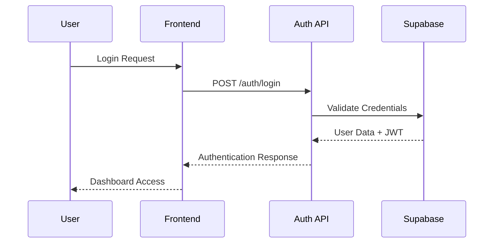
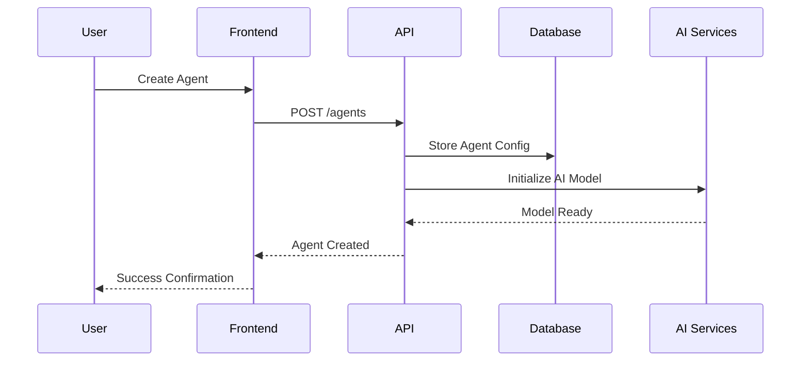
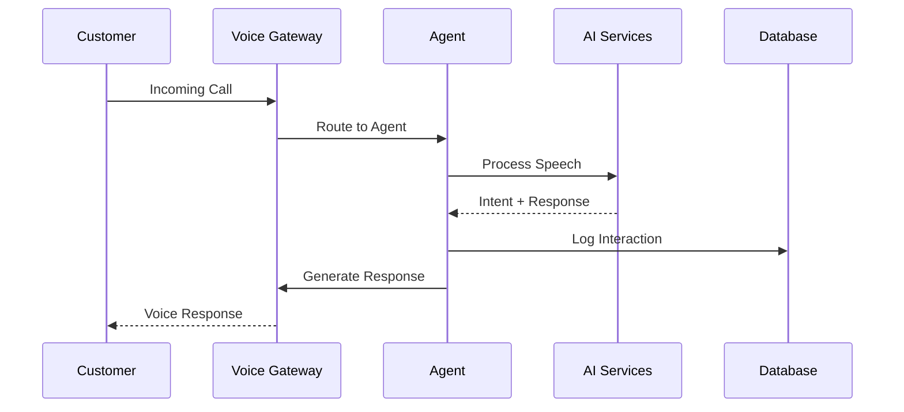

# VRM Platform Architecture

This document provides a detailed overview of the VRM Platform's architecture, including system design, component interactions, and technical decisions.

## System Overview

The VRM Platform is built as a modern, cloud-native application with a microservices-inspired architecture that prioritizes scalability, maintainability, and developer experience.

## Core Components

### 1. Frontend Application (React)

**Purpose:** User interface for managing agents, analyzing calls, and configuring the platform.

**Key Features:**
- Responsive design with Tailwind CSS
- Real-time updates via WebSocket connections
- State management with Zustand
- Type-safe development with TypeScript

**Architecture Patterns:**
- Component-based architecture
- Custom hooks for data fetching
- Centralized state management
- Route-based code splitting

### 2. Backend API (Node.js/Express)

**Purpose:** RESTful API server handling business logic, authentication, and data operations.

**Key Features:**
- Express.js framework
- JWT-based authentication
- Rate limiting and security middleware
- Comprehensive error handling

**Architecture Patterns:**
- Layered architecture (routes → middleware → services)
- Dependency injection for services
- Centralized error handling
- Request/response validation

### 3. Database Layer (Supabase/PostgreSQL)

**Purpose:** Data persistence, user management, and real-time subscriptions.

**Key Features:**
- PostgreSQL with Row Level Security (RLS)
- Built-in authentication system
- Real-time subscriptions
- Automated backups and scaling

**Schema Design:**
- Normalized relational design
- Audit trails for critical operations
- Optimized indexes for performance
- Foreign key constraints for data integrity

### 4. AI Services Integration

**Purpose:** Integration with various AI and voice processing services.

**Services:**
- **OpenAI:** Language model processing
- **Deepgram:** Speech-to-text conversion
- **Cartesia:** Text-to-speech synthesis
- **Custom Pipeline:** Voice processing and optimization

**Architecture:**
- Service abstraction layer
- Fallback mechanisms
- Response caching
- Usage monitoring

## Data Flow Architecture

### 1. User Authentication Flow



### 2. Agent Creation Flow



### 3. Call Processing Flow



## Security Architecture

### 1. Authentication & Authorization

**Multi-layered Security:**
- JWT tokens for API authentication
- Row Level Security (RLS) in database
- Role-based access control (RBAC)
- Multi-factor authentication (MFA) support

**Security Policies:**
- Password complexity requirements
- Account lockout mechanisms
- Session management
- API rate limiting

### 2. Data Protection

**Encryption:**
- TLS 1.3 for data in transit
- AES-256 for sensitive data at rest
- Encrypted environment variables
- Secure key management

**Privacy:**
- GDPR compliance measures
- Data retention policies
- User consent management
- Audit logging

## Scalability Considerations

### 1. Horizontal Scaling

**Frontend:**
- CDN distribution
- Static asset optimization
- Code splitting and lazy loading
- Browser caching strategies

**Backend:**
- Stateless API design
- Load balancer compatibility
- Database connection pooling
- Microservices readiness

### 2. Performance Optimization

**Database:**
- Query optimization
- Index strategies
- Connection pooling
- Read replicas for analytics

**Caching:**
- Redis for session storage
- API response caching
- Static asset caching
- Database query caching

## Integration Architecture

### 1. External APIs

**AI Services:**
- OpenAI GPT models
- Speech processing APIs
- Custom model endpoints
- Fallback service providers

**Third-party Integrations:**
- CRM systems via MCPs
- Payment processors
- Analytics platforms
- Communication tools

### 2. MCP (Model-Context-Protocol)

**Purpose:** Standardized way to connect AI agents with external tools and APIs.

**Components:**
- MCP Server management
- Tool discovery and registration
- Context sharing between services
- Security and authentication

## Monitoring & Observability

### 1. Application Monitoring

**Metrics:**
- API response times
- Error rates and types
- User engagement metrics
- System resource usage

**Logging:**
- Structured logging with correlation IDs
- Error tracking and alerting
- Performance monitoring
- Security event logging

### 2. Business Intelligence

**Analytics:**
- Call success rates
- Customer satisfaction scores
- Agent performance metrics
- Revenue attribution

## Development Architecture

### 1. Development Workflow

**Local Development:**
- Docker containers for consistency
- Hot reloading for rapid iteration
- Automated testing pipelines
- Code quality checks

**CI/CD Pipeline:**
- Automated testing on pull requests
- Staging environment deployments
- Production deployment automation
- Rollback capabilities

### 2. Code Organization

**Frontend Structure:**
```
src/
├── components/     # Reusable UI components
├── pages/         # Route-based page components
├── hooks/         # Custom React hooks
├── stores/        # State management
├── lib/           # Utility libraries
└── types/         # TypeScript definitions
```

**Backend Structure:**
```
server/src/
├── routes/        # API endpoint definitions
├── middleware/    # Express middleware
├── services/      # Business logic
├── models/        # Data models
└── utils/         # Helper functions
```

## Future Architecture Considerations

### 1. Microservices Migration

**Potential Services:**
- User management service
- Agent orchestration service
- Voice processing service
- Analytics service
- Notification service

### 2. Event-Driven Architecture

**Event Streaming:**
- Real-time event processing
- Event sourcing for audit trails
- Pub/sub messaging patterns
- Eventual consistency models

### 3. AI/ML Pipeline

**Machine Learning:**
- Custom model training
- A/B testing for AI responses
- Performance optimization
- Continuous learning systems

---

This architecture is designed to evolve with the platform's growth while maintaining performance, security, and developer productivity.