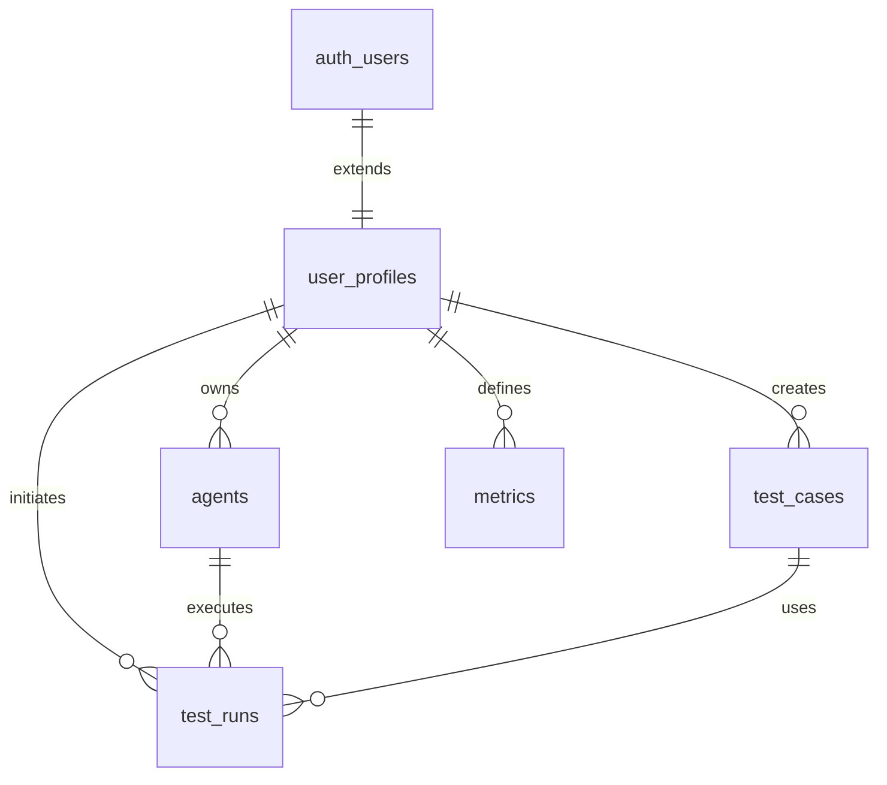
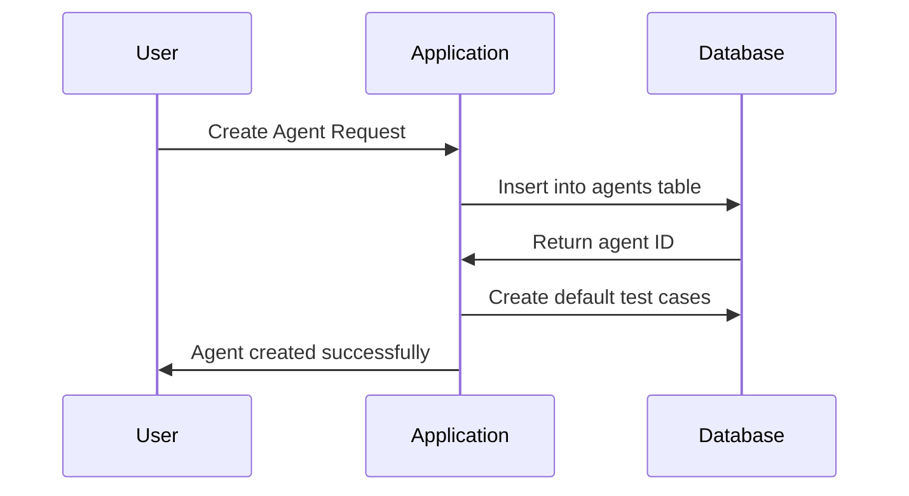
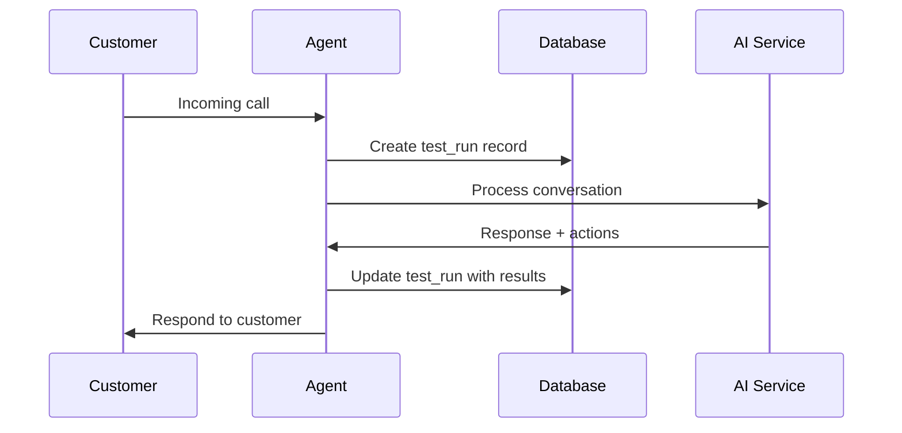
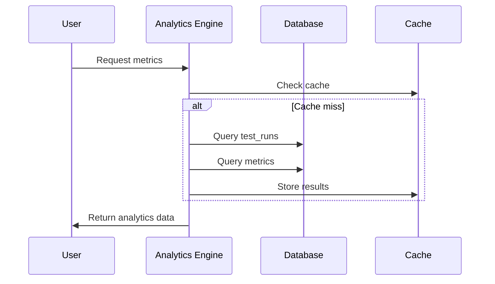

# Data Architecture

This document outlines the data architecture of the VRM Platform, including database schema, relationships, security policies, and data flow patterns.

## Database Overview

The VRM Platform uses PostgreSQL via Supabase, providing:
- ACID compliance for data integrity
- Row Level Security (RLS) for fine-grained access control
- Real-time subscriptions for live updates
- Built-in authentication and user management
- Automated backups and point-in-time recovery

## Core Schema

### User Management

#### `user_profiles`
Extends Supabase's built-in `auth.users` table with application-specific data.

```sql
CREATE TABLE user_profiles (
  id uuid PRIMARY KEY REFERENCES auth.users(id) ON DELETE CASCADE,
  email text UNIQUE NOT NULL,
  full_name text,
  avatar_url text,
  organization text,
  role user_role NOT NULL DEFAULT 'user',
  mfa_enabled boolean NOT NULL DEFAULT false,
  mfa_secret text,
  last_login timestamptz,
  login_attempts integer NOT NULL DEFAULT 0,
  locked_until timestamptz,
  created_at timestamptz NOT NULL DEFAULT now(),
  updated_at timestamptz NOT NULL DEFAULT now()
);
```

**Key Features:**
- Role-based access control with enum type
- MFA support with encrypted secrets
- Account lockout mechanism
- Audit trail with timestamps

#### `password_reset_tokens`
Manages secure password reset functionality.

```sql
CREATE TABLE password_reset_tokens (
  id uuid PRIMARY KEY DEFAULT gen_random_uuid(),
  user_id uuid NOT NULL REFERENCES auth.users(id) ON DELETE CASCADE,
  token text UNIQUE NOT NULL,
  expires_at timestamptz NOT NULL,
  used boolean NOT NULL DEFAULT false,
  created_at timestamptz NOT NULL DEFAULT now()
);
```

### Agent Management

#### `agents`
Core table for AI agent configurations.

```sql
CREATE TABLE agents (
  id uuid PRIMARY KEY DEFAULT gen_random_uuid(),
  agent_id text NOT NULL,
  agent_type text,
  connection_details jsonb,
  direction text,
  persona text,
  scenario text,
  user_id uuid REFERENCES users(id) ON DELETE CASCADE,
  created_at timestamptz DEFAULT now()
);
```

**Connection Details Structure:**
```json
{
  "voice": "sarah",
  "systemPrompt": "You are a helpful assistant...",
  "introPrompt": "Hello! How can I help you today?",
  "fallbackPrompt": "I'm sorry, I didn't understand..."
}
```

### Call Management

#### `test_runs`
Stores call session data and results.

```sql
CREATE TABLE test_runs (
  id uuid PRIMARY KEY DEFAULT gen_random_uuid(),
  user_id uuid REFERENCES users(id) ON DELETE CASCADE,
  agent_id uuid REFERENCES agents(id) ON DELETE CASCADE,
  test_case_ids jsonb,
  time_limit integer DEFAULT 60,
  outbound_call_params jsonb,
  status text NOT NULL,
  started_at timestamptz DEFAULT now(),
  completed_at timestamptz,
  results jsonb,
  error text
);
```

**Results Structure:**
```json
{
  "customer": "customer@example.com",
  "duration": "2:45",
  "sentiment": "positive",
  "actions": 3,
  "transcript": [
    {
      "speaker": "Agent",
      "message": "Hello! How can I help you?",
      "time": "00:00"
    }
  ],
  "actionsTaken": [
    {
      "action": "Retrieved customer profile",
      "time": "00:12",
      "status": "success"
    }
  ],
  "insights": [
    {
      "type": "sentiment",
      "value": "positive",
      "description": "Customer sentiment analysis"
    }
  ]
}
```

### Knowledge Management

#### `test_cases`
Stores test scenarios and user personas for agent training.

```sql
CREATE TABLE test_cases (
  id uuid PRIMARY KEY DEFAULT gen_random_uuid(),
  name text NOT NULL,
  user_id uuid REFERENCES users(id) ON DELETE CASCADE,
  user_persona jsonb,
  scenario jsonb,
  evaluator_metrics jsonb,
  is_shared boolean DEFAULT false,
  created_at timestamptz DEFAULT now()
);
```

### Metrics and Analytics

#### `metrics`
Custom metrics defined by users for tracking specific KPIs.

```sql
CREATE TABLE metrics (
  id uuid PRIMARY KEY DEFAULT gen_random_uuid(),
  name text NOT NULL,
  prompt text NOT NULL,
  user_id uuid REFERENCES users(id) ON DELETE CASCADE,
  created_at timestamptz DEFAULT now()
);
```

### API Management

#### `api_keys`
Stores encrypted API keys for external service integrations.

```sql
CREATE TABLE api_keys (
  id uuid PRIMARY KEY DEFAULT gen_random_uuid(),
  service text NOT NULL,
  key text NOT NULL, -- Encrypted in production
  description text,
  created_at timestamptz DEFAULT now()
);
```

## Data Relationships

### Entity Relationship Diagram



### Key Relationships

1. **User → Agents**: One-to-many relationship where users can create multiple agents
2. **User → Test Runs**: One-to-many relationship tracking all user's call sessions
3. **Agent → Test Runs**: One-to-many relationship showing which agent handled each call
4. **User → Metrics**: One-to-many relationship for custom metrics tracking

## Security Policies

### Row Level Security (RLS)

All tables have RLS enabled with policies ensuring users can only access their own data.

#### User Profiles
```sql
-- Users can read their own profile
CREATE POLICY "Users can read own profile"
  ON user_profiles FOR SELECT
  TO authenticated
  USING (auth.uid() = id);

-- Users can update their own profile
CREATE POLICY "Users can update own profile"
  ON user_profiles FOR UPDATE
  TO authenticated
  USING (auth.uid() = id);
```

#### Agents
```sql
-- Users can manage their own agents
CREATE POLICY "Users can manage own agents"
  ON agents FOR ALL
  TO authenticated
  USING (auth.uid() = user_id);
```

#### Test Runs
```sql
-- Users can access their own test runs
CREATE POLICY "Users can access own test runs"
  ON test_runs FOR ALL
  TO authenticated
  USING (auth.uid() = user_id);
```

### Data Encryption

**At Rest:**
- Database encryption via Supabase
- Sensitive fields (MFA secrets, API keys) encrypted with application-level encryption
- File uploads encrypted in Supabase Storage

**In Transit:**
- TLS 1.3 for all API communications
- WebSocket connections over WSS
- Encrypted backup transfers

## Data Flow Patterns

### 1. Agent Creation Flow



### 2. Call Processing Flow



### 3. Analytics Data Flow



## Performance Optimization

### Indexing Strategy

**Primary Indexes:**
```sql
-- User-based queries
CREATE INDEX idx_agents_user_id ON agents(user_id);
CREATE INDEX idx_test_runs_user_id ON test_runs(user_id);
CREATE INDEX idx_metrics_user_id ON metrics(user_id);

-- Time-based queries
CREATE INDEX idx_test_runs_started_at ON test_runs(started_at);
CREATE INDEX idx_test_runs_status ON test_runs(status);

-- Search and filtering
CREATE INDEX idx_agents_agent_id ON agents(agent_id);
CREATE INDEX idx_test_runs_agent_id ON test_runs(agent_id);
```

**Composite Indexes:**
```sql
-- User + time range queries
CREATE INDEX idx_test_runs_user_time ON test_runs(user_id, started_at);

-- Status filtering by user
CREATE INDEX idx_test_runs_user_status ON test_runs(user_id, status);
```

### Query Optimization

**Common Query Patterns:**
1. User dashboard data (recent calls, agent stats)
2. Call history with filtering and pagination
3. Agent performance metrics
4. Real-time call status updates

**Optimization Techniques:**
- Materialized views for complex analytics
- Connection pooling for high concurrency
- Read replicas for analytics queries
- Query result caching

## Data Retention and Archival

### Retention Policies

**Call Data:**
- Active calls: Indefinite retention
- Completed calls: 2 years
- Failed calls: 1 year
- Call recordings: 90 days (configurable)

**User Data:**
- Active users: Indefinite retention
- Inactive users: 3 years after last login
- Deleted accounts: 30 days for recovery

**Logs and Analytics:**
- Application logs: 90 days
- Error logs: 1 year
- Analytics data: 2 years

### Archival Strategy

```sql
-- Archive old test runs
CREATE OR REPLACE FUNCTION archive_old_test_runs()
RETURNS void AS $$
BEGIN
  -- Move old records to archive table
  INSERT INTO test_runs_archive 
  SELECT * FROM test_runs 
  WHERE completed_at < now() - interval '2 years';
  
  -- Delete archived records
  DELETE FROM test_runs 
  WHERE completed_at < now() - interval '2 years';
END;
$$ LANGUAGE plpgsql;
```

## Backup and Recovery

### Backup Strategy

**Automated Backups:**
- Daily full backups via Supabase
- Point-in-time recovery up to 7 days
- Cross-region backup replication

**Manual Backups:**
- Pre-deployment database snapshots
- Critical data exports before major changes
- User data exports on request

### Disaster Recovery

**Recovery Time Objectives (RTO):**
- Database: < 4 hours
- Application: < 1 hour
- File storage: < 2 hours

**Recovery Point Objectives (RPO):**
- Database: < 15 minutes
- File uploads: < 1 hour
- Configuration: < 5 minutes

## Monitoring and Alerting

### Database Monitoring

**Key Metrics:**
- Connection pool utilization
- Query performance and slow queries
- Storage usage and growth
- Replication lag

**Alerts:**
- High connection count
- Slow query detection
- Storage threshold exceeded
- Backup failures

### Data Quality Monitoring

**Automated Checks:**
- Foreign key constraint violations
- Data type validation
- Required field completeness
- Duplicate detection

---

This data architecture is designed to scale with the platform while maintaining data integrity, security, and performance.