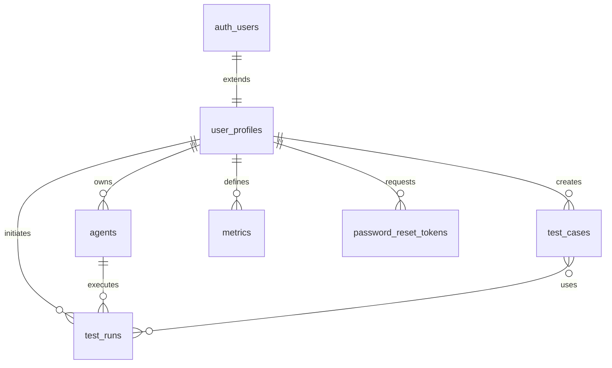

# Database Schema Documentation

This document provides a comprehensive overview of the VRM Platform's database schema, including all tables, relationships, indexes, security policies, and data types.

## Overview

The VRM Platform uses PostgreSQL via Supabase with the following key features:
- **Row Level Security (RLS)** for fine-grained access control
- **ACID compliance** for data integrity
- **Real-time subscriptions** for live updates
- **Built-in authentication** via Supabase Auth
- **Automated backups** and point-in-time recovery

## Schema Structure

### Core Tables

The database consists of several core functional areas:

1. **User Management** - Authentication and user profiles
2. **Agent Management** - AI agent configurations and metadata
3. **Call Management** - Call sessions, results, and analytics
4. **Knowledge Management** - Test cases and scenarios
5. **Metrics & Analytics** - Custom metrics and tracking
6. **API Management** - External service integrations

## Detailed Table Specifications

### 1. User Management

#### `user_profiles`
Extends Supabase's built-in `auth.users` table with application-specific data.

```sql
CREATE TABLE user_profiles (
  id uuid PRIMARY KEY REFERENCES auth.users(id) ON DELETE CASCADE,
  email text UNIQUE NOT NULL,
  full_name text,
  avatar_url text,
  organization text,
  role user_role NOT NULL DEFAULT 'user',
  mfa_enabled boolean NOT NULL DEFAULT false,
  mfa_secret text,
  last_login timestamptz,
  login_attempts integer NOT NULL DEFAULT 0,
  locked_until timestamptz,
  created_at timestamptz NOT NULL DEFAULT now(),
  updated_at timestamptz NOT NULL DEFAULT now()
);
```

**Column Details:**
- `id`: Primary key, references auth.users(id)
- `email`: User's email address (unique)
- `full_name`: User's display name
- `avatar_url`: Profile picture URL
- `organization`: Company/organization name
- `role`: User role (admin, user, viewer)
- `mfa_enabled`: Multi-factor authentication status
- `mfa_secret`: Encrypted MFA secret key
- `last_login`: Timestamp of last successful login
- `login_attempts`: Failed login attempt counter
- `locked_until`: Account lockout expiration
- `created_at`: Account creation timestamp
- `updated_at`: Last profile update timestamp

**Indexes:**
```sql
CREATE INDEX idx_user_profiles_email ON user_profiles(email);
CREATE INDEX idx_user_profiles_login_attempts ON user_profiles(login_attempts);
CREATE INDEX idx_user_profiles_locked_until ON user_profiles(locked_until);
```

**Security Policies:**
```sql
-- Users can read their own profile
CREATE POLICY "Users can read own profile"
  ON user_profiles FOR SELECT
  TO authenticated
  USING (auth.uid() = id);

-- Users can update their own profile
CREATE POLICY "Users can update own profile"
  ON user_profiles FOR UPDATE
  TO authenticated
  USING (auth.uid() = id);

-- Service role can manage all profiles
CREATE POLICY "Service role can manage all profiles"
  ON user_profiles FOR ALL
  TO service_role
  USING (true);
```

#### `password_reset_tokens`
Manages secure password reset functionality.

```sql
CREATE TABLE password_reset_tokens (
  id uuid PRIMARY KEY DEFAULT gen_random_uuid(),
  user_id uuid NOT NULL REFERENCES auth.users(id) ON DELETE CASCADE,
  token text UNIQUE NOT NULL,
  expires_at timestamptz NOT NULL,
  used boolean NOT NULL DEFAULT false,
  created_at timestamptz NOT NULL DEFAULT now()
);
```

**Column Details:**
- `id`: Primary key
- `user_id`: References the user requesting reset
- `token`: Unique reset token (hashed)
- `expires_at`: Token expiration timestamp
- `used`: Whether token has been used
- `created_at`: Token creation timestamp

**Indexes:**
```sql
CREATE INDEX idx_password_reset_tokens_token ON password_reset_tokens(token);
CREATE INDEX idx_password_reset_tokens_expires_at ON password_reset_tokens(expires_at);
CREATE INDEX idx_password_reset_tokens_user_id ON password_reset_tokens(user_id);
```

### 2. Agent Management

#### `agents`
Core table for AI agent configurations and metadata.

```sql
CREATE TABLE agents (
  id uuid PRIMARY KEY DEFAULT gen_random_uuid(),
  agent_id text NOT NULL,
  agent_type text,
  connection_details jsonb,
  direction text,
  persona text,
  scenario text,
  user_id uuid REFERENCES users(id) ON DELETE CASCADE,
  created_at timestamptz DEFAULT now()
);
```

**Column Details:**
- `id`: Primary key
- `agent_id`: Unique agent identifier (e.g., "agent_1640995200")
- `agent_type`: Type of agent (e.g., "voice", "chat")
- `connection_details`: JSON configuration for voice, prompts, etc.
- `direction`: Call direction ("inbound", "outbound")
- `persona`: Agent's personality and role description
- `scenario`: Agent's name/title
- `user_id`: Owner of the agent
- `created_at`: Agent creation timestamp

**Connection Details JSON Structure:**
```json
{
  "voice": "sarah",
  "systemPrompt": "You are a helpful customer service representative...",
  "introPrompt": "Hello! How can I help you today?",
  "fallbackPrompt": "I'm sorry, I didn't understand that..."
}
```

**Indexes:**
```sql
CREATE INDEX ix_agents_agent_id ON agents(agent_id);
CREATE INDEX ix_agents_user_id ON agents(user_id);
```

**Security Policies:**
```sql
-- Users can manage their own agents
CREATE POLICY "Users can manage own agents"
  ON agents FOR ALL
  TO authenticated
  USING (auth.uid() = user_id);
```

### 3. Call Management

#### `test_runs`
Stores call session data, results, and analytics.

```sql
CREATE TABLE test_runs (
  id uuid PRIMARY KEY DEFAULT gen_random_uuid(),
  user_id uuid REFERENCES users(id) ON DELETE CASCADE,
  agent_id uuid REFERENCES agents(id) ON DELETE CASCADE,
  test_case_ids jsonb,
  time_limit integer DEFAULT 60,
  outbound_call_params jsonb,
  status text NOT NULL,
  started_at timestamptz DEFAULT now(),
  completed_at timestamptz,
  results jsonb,
  error text
);
```

**Column Details:**
- `id`: Primary key
- `user_id`: User who initiated the call
- `agent_id`: Agent handling the call
- `test_case_ids`: Array of test case IDs used
- `time_limit`: Maximum call duration in seconds
- `outbound_call_params`: Call parameters (customer info, etc.)
- `status`: Call status ("in-progress", "completed", "failed")
- `started_at`: Call start timestamp
- `completed_at`: Call completion timestamp
- `results`: JSON with call results and analytics
- `error`: Error message if call failed

**Results JSON Structure:**
```json
{
  "customer": "customer@example.com",
  "duration": "2:45",
  "sentiment": "positive",
  "actions": 3,
  "transcript": [
    {
      "speaker": "Agent",
      "message": "Hello! How can I help you?",
      "time": "00:00"
    },
    {
      "speaker": "Customer", 
      "message": "I need help with my account",
      "time": "00:05"
    }
  ],
  "actionsTaken": [
    {
      "action": "Retrieved customer profile",
      "time": "00:12",
      "status": "success"
    }
  ],
  "insights": [
    {
      "type": "sentiment",
      "value": "positive",
      "description": "Customer sentiment analysis"
    }
  ],
  "recordingUrl": "https://storage.supabase.co/..."
}
```

**Indexes:**
```sql
CREATE INDEX ix_test_runs_agent_id ON test_runs(agent_id);
CREATE INDEX ix_test_runs_status ON test_runs(status);
CREATE INDEX ix_test_runs_user_id ON test_runs(user_id);
```

**Security Policies:**
```sql
-- Users can access their own test runs
CREATE POLICY "Users can access own test runs"
  ON test_runs FOR ALL
  TO authenticated
  USING (auth.uid() = user_id);
```

### 4. Knowledge Management

#### `test_cases`
Stores test scenarios and user personas for agent training.

```sql
CREATE TABLE test_cases (
  id uuid PRIMARY KEY DEFAULT gen_random_uuid(),
  name text NOT NULL,
  user_id uuid REFERENCES users(id) ON DELETE CASCADE,
  user_persona jsonb,
  scenario jsonb,
  evaluator_metrics jsonb,
  is_shared boolean DEFAULT false,
  created_at timestamptz DEFAULT now()
);
```

**Column Details:**
- `id`: Primary key
- `name`: Test case name/title
- `user_id`: Creator of the test case
- `user_persona`: JSON describing the customer persona
- `scenario`: JSON describing the test scenario
- `evaluator_metrics`: JSON with evaluation criteria
- `is_shared`: Whether test case is shared with other users
- `created_at`: Creation timestamp

**JSON Structure Examples:**

**User Persona:**
```json
{
  "name": "Frustrated Customer",
  "background": "Long-time customer having technical issues",
  "goals": ["Get technical support", "Resolve issue quickly"],
  "pain_points": ["Previous bad support experience", "Time constraints"],
  "communication_style": "Direct, somewhat impatient"
}
```

**Scenario:**
```json
{
  "title": "Account Access Issue",
  "description": "Customer cannot log into their account",
  "initial_message": "I can't log into my account and I have an important meeting in 10 minutes",
  "expected_resolution": "Password reset or account unlock",
  "complexity": "medium"
}
```

**Evaluator Metrics:**
```json
{
  "response_time": {"target": "< 30 seconds", "weight": 0.3},
  "resolution_rate": {"target": "> 90%", "weight": 0.4},
  "customer_satisfaction": {"target": "> 4.0/5", "weight": 0.3}
}
```

**Indexes:**
```sql
CREATE INDEX ix_test_cases_user_id ON test_cases(user_id);
```

### 5. Metrics & Analytics

#### `metrics`
Custom metrics defined by users for tracking specific KPIs.

```sql
CREATE TABLE metrics (
  id uuid PRIMARY KEY DEFAULT gen_random_uuid(),
  name text NOT NULL,
  prompt text NOT NULL,
  user_id uuid REFERENCES users(id) ON DELETE CASCADE,
  created_at timestamptz DEFAULT now()
);
```

**Column Details:**
- `id`: Primary key
- `name`: Metric display name
- `prompt`: Tool call or identifier for tracking
- `user_id`: User who created the metric
- `created_at`: Creation timestamp

**Examples:**
```sql
INSERT INTO metrics (name, prompt, user_id) VALUES
('Support Tickets Created', 'createSupportTicket', 'user-uuid'),
('Payment Processing', 'processPayment', 'user-uuid'),
('Feature Requests', 'logFeatureRequest', 'user-uuid');
```

**Indexes:**
```sql
CREATE INDEX ix_metrics_user_id ON metrics(user_id);
```

### 6. API Management

#### `api_keys`
Stores encrypted API keys for external service integrations.

```sql
CREATE TABLE api_keys (
  id uuid PRIMARY KEY DEFAULT gen_random_uuid(),
  service text NOT NULL,
  key text NOT NULL,
  description text,
  created_at timestamptz DEFAULT now()
);
```

**Column Details:**
- `id`: Primary key
- `service`: Service name (e.g., "openai", "deepgram")
- `key`: Encrypted API key
- `description`: Optional description
- `created_at`: Creation timestamp

**Indexes:**
```sql
CREATE INDEX ix_api_keys_service ON api_keys(service);
```

**Security Note:** API keys should be encrypted at the application level before storage.

### 7. System Tables

#### `alembic_version`
Database migration version tracking (from legacy system).

```sql
CREATE TABLE alembic_version (
  version_num character varying(32) PRIMARY KEY
);
```

## Custom Types

### `user_role` Enum
Defines user permission levels.

```sql
CREATE TYPE user_role AS ENUM ('admin', 'user', 'viewer');
```

**Role Descriptions:**
- `admin`: Full platform access, user management
- `user`: Standard user with agent creation and management
- `viewer`: Read-only access to shared resources

## Database Functions

### Utility Functions

#### `update_updated_at_column()`
Automatically updates the `updated_at` timestamp.

```sql
CREATE OR REPLACE FUNCTION update_updated_at_column()
RETURNS TRIGGER
LANGUAGE plpgsql
AS $$
BEGIN
  NEW.updated_at = now();
  RETURN NEW;
END;
$$;
```

#### `increment_login_attempts()`
Safely increments login attempt counter with account locking.

```sql
CREATE OR REPLACE FUNCTION increment_login_attempts(user_email text)
RETURNS void
LANGUAGE plpgsql
SECURITY DEFINER
AS $$
DECLARE
  current_attempts integer;
BEGIN
  -- Get current attempts
  SELECT login_attempts INTO current_attempts
  FROM user_profiles 
  WHERE email = user_email;
  
  -- Increment attempts
  UPDATE user_profiles 
  SET 
    login_attempts = login_attempts + 1,
    locked_until = CASE 
      WHEN login_attempts + 1 >= 5 THEN now() + interval '15 minutes'
      ELSE locked_until
    END,
    updated_at = now()
  WHERE email = user_email;
END;
$$;
```

#### `handle_new_user()`
Creates user profile when new user signs up.

```sql
CREATE OR REPLACE FUNCTION handle_new_user()
RETURNS TRIGGER
LANGUAGE plpgsql
SECURITY DEFINER
AS $$
BEGIN
  INSERT INTO user_profiles (id, email, full_name, organization)
  VALUES (
    NEW.id,
    NEW.email,
    NEW.raw_user_meta_data->>'full_name',
    NEW.raw_user_meta_data->>'organization'
  );
  RETURN NEW;
END;
$$;
```

## Triggers

### Automatic Timestamp Updates

```sql
-- Update user_profiles.updated_at on changes
CREATE TRIGGER update_user_profiles_updated_at
  BEFORE UPDATE ON user_profiles
  FOR EACH ROW
  EXECUTE FUNCTION update_updated_at_column();
```

### User Registration

```sql
-- Create profile when user signs up
CREATE TRIGGER on_auth_user_created
  AFTER INSERT ON auth.users
  FOR EACH ROW
  EXECUTE FUNCTION handle_new_user();
```

## Relationships and Foreign Keys

### Entity Relationship Diagram



### Foreign Key Constraints

```sql
-- User profiles extend auth.users
ALTER TABLE user_profiles 
  ADD CONSTRAINT user_profiles_id_fkey 
  FOREIGN KEY (id) REFERENCES auth.users(id) ON DELETE CASCADE;

-- Agents belong to users
ALTER TABLE agents 
  ADD CONSTRAINT agents_user_id_fkey 
  FOREIGN KEY (user_id) REFERENCES users(id) ON DELETE CASCADE;

-- Test runs belong to users and agents
ALTER TABLE test_runs 
  ADD CONSTRAINT test_runs_user_id_fkey 
  FOREIGN KEY (user_id) REFERENCES users(id) ON DELETE CASCADE;

ALTER TABLE test_runs 
  ADD CONSTRAINT test_runs_agent_id_fkey 
  FOREIGN KEY (agent_id) REFERENCES agents(id) ON DELETE CASCADE;

-- Test cases belong to users
ALTER TABLE test_cases 
  ADD CONSTRAINT test_cases_user_id_fkey 
  FOREIGN KEY (user_id) REFERENCES users(id) ON DELETE CASCADE;

-- Metrics belong to users
ALTER TABLE metrics 
  ADD CONSTRAINT metrics_user_id_fkey 
  FOREIGN KEY (user_id) REFERENCES users(id) ON DELETE CASCADE;

-- Password reset tokens belong to users
ALTER TABLE password_reset_tokens 
  ADD CONSTRAINT password_reset_tokens_user_id_fkey 
  FOREIGN KEY (user_id) REFERENCES auth.users(id) ON DELETE CASCADE;
```

## Performance Optimization

### Index Strategy

**User-based Queries:**
```sql
-- Optimize user data lookups
CREATE INDEX idx_agents_user_id ON agents(user_id);
CREATE INDEX idx_test_runs_user_id ON test_runs(user_id);
CREATE INDEX idx_test_cases_user_id ON test_cases(user_id);
CREATE INDEX idx_metrics_user_id ON metrics(user_id);
```

**Time-based Queries:**
```sql
-- Optimize time-range queries
CREATE INDEX idx_test_runs_started_at ON test_runs(started_at);
CREATE INDEX idx_test_runs_completed_at ON test_runs(completed_at);
CREATE INDEX idx_user_profiles_last_login ON user_profiles(last_login);
```

**Status and Filtering:**
```sql
-- Optimize status filtering
CREATE INDEX idx_test_runs_status ON test_runs(status);
CREATE INDEX idx_test_runs_user_status ON test_runs(user_id, status);
```

**Composite Indexes:**
```sql
-- Optimize dashboard queries
CREATE INDEX idx_test_runs_user_time ON test_runs(user_id, started_at DESC);
CREATE INDEX idx_agents_user_created ON agents(user_id, created_at DESC);
```

### Query Optimization Examples

**Dashboard Recent Calls:**
```sql
-- Optimized query for user dashboard
SELECT tr.*, a.scenario as agent_name
FROM test_runs tr
JOIN agents a ON tr.agent_id = a.id
WHERE tr.user_id = $1
ORDER BY tr.started_at DESC
LIMIT 10;
```

**Agent Performance Analytics:**
```sql
-- Optimized agent performance query
SELECT 
  a.id,
  a.scenario,
  COUNT(tr.id) as total_calls,
  AVG(EXTRACT(EPOCH FROM (tr.completed_at - tr.started_at))) as avg_duration,
  COUNT(CASE WHEN tr.status = 'completed' THEN 1 END) as successful_calls
FROM agents a
LEFT JOIN test_runs tr ON a.id = tr.agent_id
WHERE a.user_id = $1
GROUP BY a.id, a.scenario
ORDER BY total_calls DESC;
```

## Security Considerations

### Row Level Security (RLS)

All user data tables have RLS enabled with policies ensuring users can only access their own data:

```sql
-- Enable RLS on all user tables
ALTER TABLE user_profiles ENABLE ROW LEVEL SECURITY;
ALTER TABLE agents ENABLE ROW LEVEL SECURITY;
ALTER TABLE test_runs ENABLE ROW LEVEL SECURITY;
ALTER TABLE test_cases ENABLE ROW LEVEL SECURITY;
ALTER TABLE metrics ENABLE ROW LEVEL SECURITY;
ALTER TABLE password_reset_tokens ENABLE ROW LEVEL SECURITY;
```

### Data Encryption

**Application-level Encryption:**
- MFA secrets encrypted before storage
- API keys encrypted with application key
- Sensitive user data encrypted at rest

**Database-level Encryption:**
- TLS 1.3 for connections
- Transparent data encryption via Supabase
- Encrypted backups

### Audit Trail

**Automatic Timestamps:**
- `created_at` on all tables
- `updated_at` on mutable tables
- `last_login` tracking

**Change Tracking:**
- Login attempt monitoring
- Account lockout logging
- Failed authentication tracking

## Backup and Recovery

### Backup Strategy

**Automated Backups:**
- Daily full backups via Supabase
- Point-in-time recovery (7 days)
- Cross-region replication

**Manual Backup Commands:**
```sql
-- Create full backup
pg_dump $DATABASE_URL > backup-$(date +%Y%m%d).sql

-- Create schema-only backup
pg_dump --schema-only $DATABASE_URL > schema-backup.sql

-- Create data-only backup
pg_dump --data-only $DATABASE_URL > data-backup.sql
```

### Recovery Procedures

**Point-in-time Recovery:**
```sql
-- Restore to specific timestamp
SELECT * FROM restore_point_in_time('2024-01-15 10:30:00');
```

**Selective Recovery:**
```sql
-- Restore specific table
pg_restore --table=agents backup-20240115.sql
```

## Migration Management

### Migration Files

Migrations are stored in `supabase/migrations/` with descriptive names:

```
supabase/migrations/
├── 20250628111902_damp_limit.sql          # Initial auth setup
├── 20250629000000_add_agent_analytics.sql # Agent analytics
└── 20250630000000_add_knowledge_base.sql  # Knowledge management
```

### Migration Best Practices

1. **Always use transactions** for complex migrations
2. **Include rollback procedures** in comments
3. **Test migrations** on staging first
4. **Use IF EXISTS/IF NOT EXISTS** for safety
5. **Document breaking changes** thoroughly

### Example Migration Template

```sql
/*
  # Migration Title
  
  1. Changes Made
    - Add new table: example_table
    - Modify existing table: agents
    - Add new indexes for performance
  
  2. Rollback Instructions
    - DROP TABLE example_table;
    - ALTER TABLE agents DROP COLUMN new_column;
    - DROP INDEX idx_example;
*/

BEGIN;

-- Your migration SQL here
CREATE TABLE IF NOT EXISTS example_table (
  id uuid PRIMARY KEY DEFAULT gen_random_uuid(),
  name text NOT NULL,
  created_at timestamptz DEFAULT now()
);

-- Add indexes
CREATE INDEX IF NOT EXISTS idx_example_name ON example_table(name);

-- Enable RLS
ALTER TABLE example_table ENABLE ROW LEVEL SECURITY;

-- Add policies
CREATE POLICY "Users can manage own examples"
  ON example_table FOR ALL
  TO authenticated
  USING (auth.uid() = user_id);

COMMIT;
```

---

This schema documentation provides a complete reference for understanding and working with the VRM Platform's database structure. Keep this document updated as the schema evolves.